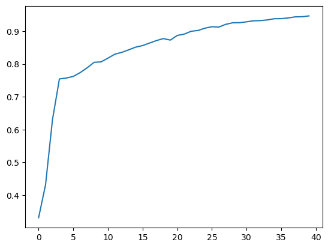
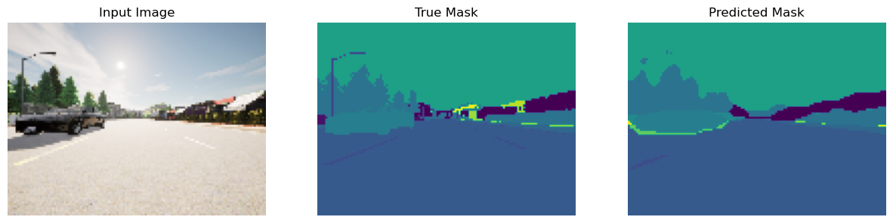
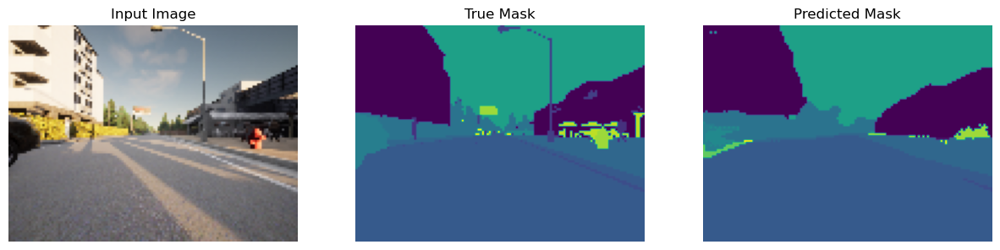
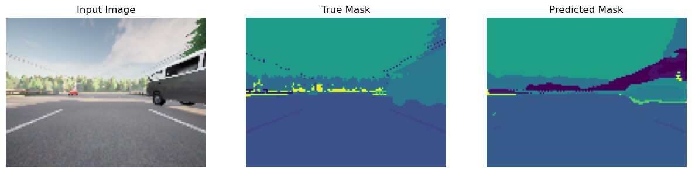
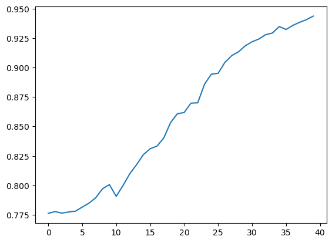
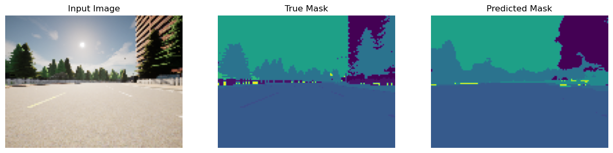
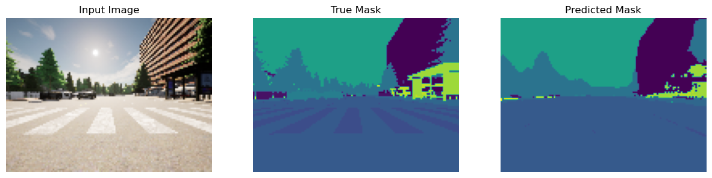
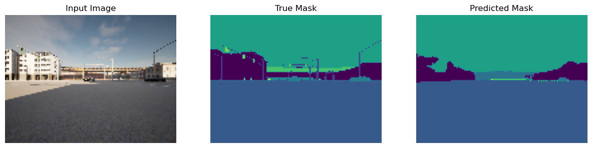

# Image Segmentation Using U-Net

## Project Description
This project implements **semantic image segmentation** using the **U-Net** architecture on a self-driving car dataset from the [CARLA simulator](https://carla.org/). The goal is to accurately segment each pixel of a driving scene into one of **23 semantic classes** (e.g., road, vehicle, pedestrian, building, etc.).

Additionally, a **Fully Convolutional Network (FCN)** is implemented as a baseline for comparison, demonstrating the advantage of U-Net's skip connections in preserving spatial detail.

## Architecture Details

### U-Net Architecture
The U-Net architecture features a symmetric encoder-decoder structure with **skip connections** that concatenate encoder features with decoder features at corresponding levels:


- **Contracting Path (Encoder)**: Four blocks of double Conv2D (3×3, ReLU) + Dropout (0.1) + MaxPooling (2×2), with filters: 32 → 64 → 128 → 256
- **Bottleneck**: Double Conv2D (3×3, ReLU) with 512 filters + Dropout (0.3)
- **Expansive Path (Decoder)**: Four blocks of Conv2DTranspose (3×3, stride 2) + **Concatenation with skip connections** + double Conv2D (3×3, ReLU) + Dropout (0.1), with filters: 256 → 128 → 64 → 32
- **Output Layer**: Conv2D (1×1) with 23 filters for pixel-wise classification
- **Total Parameters**: ~7.8M (trainable)

### FCN Architecture
A simpler encoder-decoder without skip connections for comparison:
- Same contracting path as U-Net
- Decoder uses Conv2DTranspose for upsampling **without** skip connections
- **Total Parameters**: ~2.9M (trainable)

## Dataset Information
This project uses the [CARLA Self-Driving Car Dataset](https://carla.org/) which contains synthetic driving scene images with corresponding segmentation masks.

| Property | Details |
|---|---|
| **Source** | [CARLA Simulator](https://carla.org/) |
| **Total Images** | 1,060 RGB images + 1,060 segmentation masks |
| **Image Size** | 96 × 128 pixels |
| **Number of Classes** | 23 semantic classes |
| **Train/Test Split** | 848 training / 212 test images |
| **Format** | PNG images (RGB) and corresponding mask images |

### Sample Data
Each input RGB image has a corresponding segmentation mask where each pixel is labeled with a class ID (0–22). The mask is visualized with distinct colors for each class.

## Training Details

| Parameter | U-Net | FCN |
|---|---|---|
| **Optimizer** | Adam | Adam |
| **Loss Function** | Sparse Categorical Crossentropy (from logits) | Sparse Categorical Crossentropy (from logits) |
| **Batch Size** | 32 | 32 |
| **Epochs** | 40 | 40 |
| **Final Training Accuracy** | ~94.4% | ~94.4% |
| **Test Accuracy** | — | ~90.1% |

## Results

### U-Net Training Accuracy


### U-Net Segmentation Results
Each row shows: **Input Image** | **True Mask** | **Predicted Mask**





### FCN Training Accuracy


### FCN Segmentation Results
Each row shows: **Input Image** | **True Mask** | **Predicted Mask**





### Key Observations
- **U-Net outperforms FCN** in segmentation quality thanks to skip connections, which help preserve fine spatial details from the encoder
- The U-Net model achieves **smoother and more accurate boundary delineation** compared to the FCN
- Both models converge within 40 epochs, but U-Net reaches higher accuracy faster

## Installation & Usage

### Prerequisites
- Python 3.8+
- TensorFlow / Keras
- NumPy, Matplotlib

### Setup
1. Clone the repository:
   ```bash
   git clone https://github.com/sravya0204/Image-segmentation-using-U-Net.git
   cd Image-segmentation-using-U-Net
   ```

2. Install the required packages:
   ```bash
   pip install tensorflow numpy matplotlib
   ```

3. Run the Jupyter Notebook:
   ```bash
   jupyter notebook ImageSegmentation_code.ipynb
   ```

### Repository Structure
```
Image-segmentation-using-U-Net/
├── ImageSegmentation_code.ipynb    # Main notebook with U-Net & FCN implementations
├── CameraRGB/                     # Input RGB images (1,060 images)
├── CameraMask/                    # Segmentation masks (1,060 masks)
├── train/                         # Training data split
├── test/                          # Test data split
├── results/                       # Output prediction images
├── u-net-architecture.png         # U-Net architecture diagram
├── Image Segmentation U-Net (2).pptx  # Project presentation
├── imagesegmentation_final_report.pdf # Final project report
└── README.md                      # This file
```

## References
- [U-Net: Convolutional Networks for Biomedical Image Segmentation](https://arxiv.org/abs/1505.04597) — Ronneberger et al., 2015
- [CARLA Simulator](https://carla.org/) — Open-source simulator for autonomous driving research
- [Fully Convolutional Networks for Semantic Segmentation](https://arxiv.org/abs/1411.4038) — Long et al., 2015

## License
This project is licensed under the MIT License. See the LICENSE file for more details.